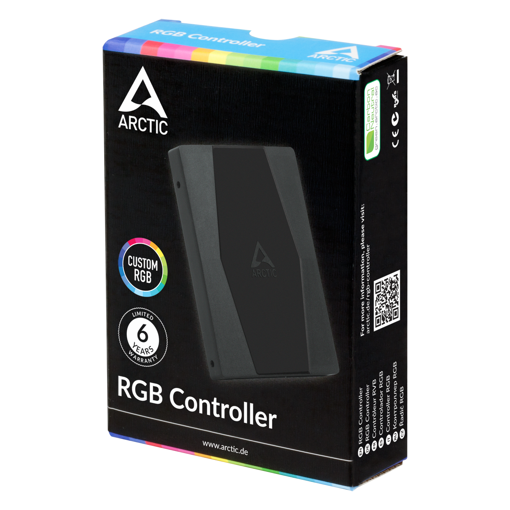

# Arctic Bridge

A Python script that bridges WLED UDP protocols (WARLS, DRGB, DNRGB, DDP) to the Arctic RGB controller via Serial. This allows you to control your Arctic RGB Controller using SignalRGB instead of Arctic RGB Master.
It might work with other software that can control WLED instances but I have only tested SignalRGB.

## Requirements

*   Python 3.x
*   Arctic RGB Controller (VID: `0x1A86`, PID: `0x7523`)


## Installation

1.  Clone the repository.
2.  Install dependencies:
    ```bash
    pip install -r requirements.txt
    ```

## Usage

Run the script:
```bash
python arctic_bridge.py
```

To enable the debug console window (Windows only):
```bash
python arctic_bridge.py --console
```

If you want to create an executable from the sript to put into autostart you can run:
```bash
py -m PyInstaller --onefile --noconsole arctic_bridge.py
```
## SignalRGB Configuration

1. Open SignalRGB and add a new WLED instance with the IP 127.0.0.1
2. Once the connection has been established, naviaget to the new WLED device configure four seperate 1-LED strips, each strip will correspond to one of the controllers outputs
3. The lights connected to your Arctic controller should now be synced to the rest of your setup
4. Troubleshooting: Run the script / executable with ```--console``` to check for any errors
